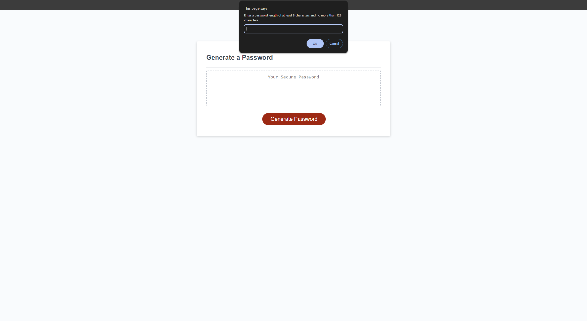

# w3-password-generator

## Description

This webpage is a random password generator. 

## Installation

N/A

## Usage

Access the webpage using the following [link](https://trahy.github.io/w3-password-generator/)

Once redirected to the webpage, click on the "Generate Password" button.

You will then be prompted on the following criterias:

* Desired length of password
* To include lowercase characters into your password, or not
* To include uppercase characters into your password, or not
* To include numbers into your password, or not
* To include special characters into your password, or not

At least one of these criterias must be selected in order to generate your password.

Once completed, you will be provided with a unique password with your chosen criteria.

The following image shows what the application should look like:

## Credits

Special thanks to Xandromus for providing the starter code for this application.

https://github.com/coding-boot-camp/friendly-parakeet

## License

Please refer to the LICENSE in the repo.

---
